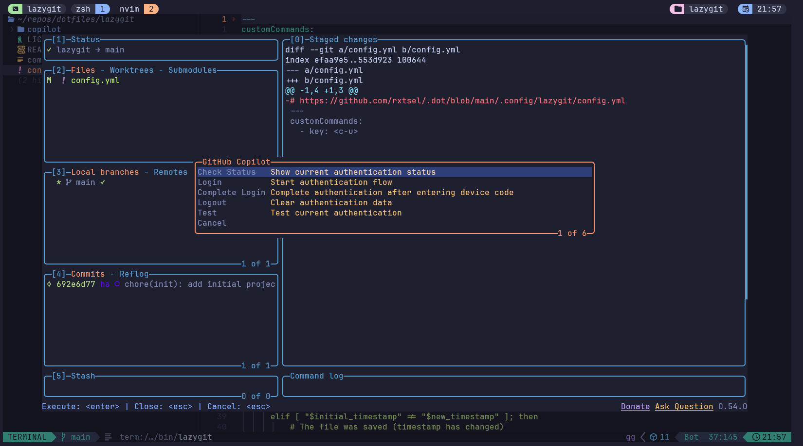
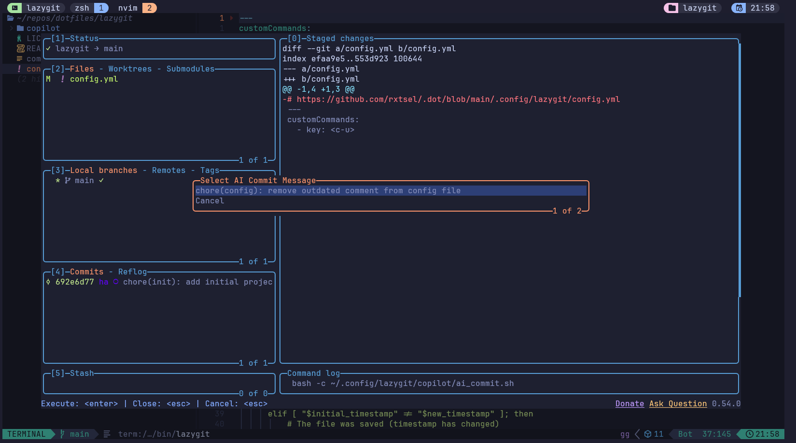

# LazyCommit

A comprehensive lazygit configuration with modular AI provider support for
intelligent commit message generation and advanced git workflow enhancements.
Currently supports GitHub Copilot with a clean architecture for adding
additional AI providers.

## Screenshots





## Features

- 🤖 **AI Commit Messages**: Generate intelligent commit messages using AI
  providers
- 🎯 **Multiple AI Models**: Support for different AI models with easy switching
- 🔌 **Provider Architecture**: Modular system supporting multiple AI providers
  (GitHub Copilot included)
- 📝 **Custom Prompts**: Use custom commit prompt templates
- 🔐 **Secure Authentication**: Built-in authentication flows per provider
- ⚡ **Custom Commands**: Powerful keyboard shortcuts for enhanced productivity
- 🎨 **Interactive Menus**: User-friendly selection interfaces

## Quick Start

### Installation

Clone LazyCommit directly to the proper location and use lazygit's multiple
config file support for seamless integration.

#### Step 1: Clone to the Correct Location

```bash
# Clone LazyCommit to the lazygit lazycommit subdirectory
git clone https://github.com/Hamxter/lazycommit.git ~/.config/lazygit/lazycommit
```

#### Step 2: Configure Multiple Config Files

LazyCommit uses lazygit's multiple config file feature. You need to tell
lazygit to load both the LazyCommit config and your personal config.

#### Method A: Environment Variable (Recommended)

Add to your shell config (`~/.zshrc`, `~/.bashrc`, etc.):

```bash
# LAZYGIT - Use multiple config files
export LG_CONFIG_FILE="$HOME/.config/lazygit/lazycommit/config.yml,\
$HOME/.config/lazygit/config.yml"
```

#### Method B: Shell Alias

```bash
# Add to ~/.bashrc, ~/.zshrc, etc.
alias lg='lazygit --use-config-file="\
~/.config/lazygit/lazycommit/config.yml,\
~/.config/lazygit/config.yml"'
```

#### Step 3: Create Your Personal Config

Create your personal lazygit config file:

```bash
# Create your personal config file (if it doesn't exist)
touch ~/.config/lazygit/config.yml

# Or copy from existing backup if you have one
# cp ~/.config/lazygit.backup/config.yml ~/.config/lazygit/config.yml
```

**Benefits of this approach:**

- ✅ LazyCommit functionality is immediately available
- ✅ Your personal lazygit settings override LazyCommit defaults
- ✅ Easy updates by pulling the latest changes in the lazycommit subdirectory
- ✅ Clean separation between LazyCommit features and personal configuration
- ✅ Can easily disable by removing the environment variable or alias
- ✅ Environment variable method works with any lazygit invocation (recommended)

### Prerequisites

- [lazygit](https://github.com/jesseduffield/lazygit) installed
- GitHub account with Copilot access (for GitHub Copilot provider)
- `curl` and `jq` for API interactions

### Authentication Setup

1. Open lazygit in any git repository
2. Press `Ctrl+G` to open the Copilot menu
3. Select "Login" to start authentication
4. Follow the device flow instructions
5. Select "Complete Login" after entering the device code

## Keyboard Shortcuts

| Key | Context | Description |
|-----|---------|-------------|
| `Ctrl+U` | Files | Generate AI commit message |
| `Ctrl+G` | Global | AI provider management (GitHub Copilot) |
| `Ctrl+N` | Global | Select AI model |

## Commands

### AI Commit Generation (`Ctrl+U`)

1. Stage your changes in lazygit
2. Press `Ctrl+U` in the files view
3. Select from AI-generated commit messages
4. Edit the message if needed
5. Commit automatically applies

### AI Provider Management (`Ctrl+G`)

Access provider-specific management options. For GitHub Copilot:

- **Check Status**: View current authentication state
- **Login**: Start GitHub authentication flow
- **Complete Login**: Finish authentication process
- **Logout**: Clear stored credentials
- **Test**: Verify authentication works

### Model Selection (`Ctrl+N`)

Switch between available AI models for commit generation.

#### Performance Recommendations

For optimal performance, consider selecting a smaller or mini model like
`gpt-4o-mini` for commit message generation. Since commit messages are
relatively simple text summaries, they don't require the advanced capabilities
of larger models. Using smaller models provides:

- **Faster response times** - Quicker commit message generation
- **Lower latency** - Reduced waiting time during your workflow
- **Better reliability** - Less likely to hit rate limits or timeouts

Most mini/small models are perfectly capable of generating high-quality commit
messages while significantly improving your development workflow speed.

## File Structure

### Multiple Config Setup (Recommended)

```text
~/.config/lazygit/
├── config.yml                     # Your personal lazygit settings
├── lazycommit/                     # LazyCommit repository (git clone location)
│   ├── config.yml                 # LazyCommit configuration
│   ├── commit_prompt.txt          # Default AI prompt template
│   ├── core/                      # Main executable scripts
│   │   ├── ai_commit.sh           # AI commit generation entry point
│   │   ├── commit.sh              # Commit wrapper script
│   │   └── models.sh              # Model management entry point
│   ├── lib/                       # Shared utilities and interfaces
│   │   ├── ai_interface.sh        # Generic AI provider interface
│   │   ├── models_interface.sh    # Generic model management interface
│   │   ├── process_commit.sh      # Commit processing utilities
│   │   └── prompt_utils.sh        # Prompt and git context utilities
│   ├── providers/                 # AI provider implementations
│   │   └── copilot/              # GitHub Copilot provider
│   │       ├── auth.sh, auth_utils.sh, device_flow.sh
│   │       ├── copilot.sh        # Main Copilot controller
│   │       ├── models.sh         # Copilot model provider
│   │       └── provider.sh       # Copilot AI provider implementation
│   ├── selected_model.txt         # User's preferred model (auto-generated)
│   ├── selected_provider.txt      # User's preferred provider (auto-generated)
│   ├── auth.json                  # Authentication data (auto-generated)
│   ├── models_cache.json          # Cached AI models (auto-generated)
│   ├── images/                    # Screenshots and documentation images
│   ├── README.md                  # This file
│   └── LICENSE                    # License file
```

**Config Loading Order:**

1. `~/.config/lazygit/lazycommit/config.yml` (LazyCommit features)
2. `~/.config/lazygit/config.yml` (Your personal settings - overrides
   LazyCommit defaults)

## Troubleshooting

### Multiple Config Files Issues

If you're having issues with the multiple config file setup:

```bash
# Check your LG_CONFIG_FILE environment variable
echo $LG_CONFIG_FILE

# Test if your config files are valid
lazygit --help

# Or test with explicit config files
lazygit --use-config-file="\
~/.config/lazygit/lazycommit/config.yml,\
~/.config/lazygit/config.yml" --help

# Check if files exist
ls -la ~/.config/lazygit/lazycommit/config.yml
ls -la ~/.config/lazygit/config.yml

# Update LazyCommit
cd ~/.config/lazygit/lazycommit && git pull
```

### Authentication Issues

```bash
# Check authentication status
~/.config/lazygit/lazycommit/providers/copilot/copilot.sh status

# Re-authenticate if needed
~/.config/lazygit/lazycommit/providers/copilot/copilot.sh logout
~/.config/lazygit/lazycommit/providers/copilot/copilot.sh login
```

### API Errors

- Ensure you have active GitHub Copilot subscription
- Check internet connectivity
- Verify authentication with test command

## Customization

### Using Multiple Config Files (Recommended)

Add your customizations to `~/.config/lazygit/config.yml`. This file is loaded
after the LazyCommit config, so your settings will override LazyCommit
defaults.

Example `~/.config/lazygit/config.yml`:

```yaml
# Your personal lazygit configuration
# (LazyCommit config is loaded first, then these settings override)

# Add your own custom commands
customCommands:
  - key: 'Y'
    context: 'global'
    description: 'My custom command'
    command: 'echo "Hello from custom command"'

# Customize other lazygit settings
gui:
  theme:
    # Your theme preferences
```

### Modify AI Prompts

LazyCommit supports custom prompts with automatic fallback:

1. **Custom Prompt**: Create `~/.config/lazygit/commit_prompt.txt` for your
   personal prompt
2. **Default Prompt**: Falls back to
   `~/.config/lazygit/lazycommit/commit_prompt.txt`

```bash
# Create your custom prompt (recommended)
$EDITOR ~/.config/lazygit/commit_prompt.txt

# Or edit the default prompt (may create git conflicts):> [!WARNING]
$EDITOR ~/.config/lazygit/lazycommit/commit_prompt.txt
```

## Repository as Subdirectory

This configuration is designed to work as a standalone repository within
your dotfiles or as an independent clone. The scripts use absolute paths
to ensure compatibility regardless of the parent repository structure.

### Updating LazyCommit

```bash
# Update LazyCommit while preserving your personal configuration
cd ~/.config/lazygit/lazycommit
git pull origin main
```

Your personal settings in `~/.config/lazygit/config.yml` remain completely
untouched with this approach.

## Contributing

1. Fork the repository
2. Create a feature branch
3. Make your changes
4. Test thoroughly with different git repositories
5. Submit a pull request

## License

MIT License - see LICENSE file for details.

## Acknowledgments

- [lazygit](https://github.com/jesseduffield/lazygit) - Amazing terminal UI
  for git
- [GitHub Copilot](https://github.com/features/copilot) - AI pair programmer
- [rxtsel's dotfiles](https://github.com/rxtsel/.dot) - Original configuration
  inspiration and foundation for this project
- [m7medVision/lazycommit](https://github.com/m7medVision/lazycommit) - Another
  excellent AI commit message tool for lazygit

## Support

If you encounter issues:

1. Check the [troubleshooting section](#troubleshooting)
2. Review lazygit logs: `lazygit --logs`
3. Open an issue with detailed error information

---

**Note**: This is a community-maintained configuration. It is not officially
affiliated with GitHub or the lazygit project.
